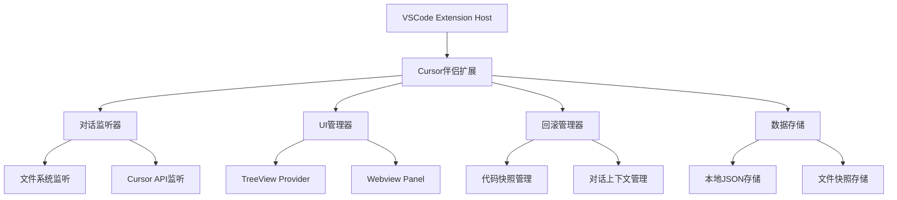

# 设计文档

## 概述

Cursor伴侣UI是一个VSCode扩展功能，旨在为开发者提供完整的Cursor AI对话管理和回滚系统。该系统通过监听Cursor的内部事件来自动跟踪对话，使用TreeView提供直观的UI界面，并实现精确的代码和对话上下文回滚功能。

核心设计理念：
- **非侵入性监听**：通过VSCode API和文件系统监听来跟踪对话，不干扰用户正常工作流程
- **状态快照管理**：为每个对话消息创建完整的代码状态快照
- **原子性回滚**：确保回滚操作要么完全成功要么完全失败
- **用户体验优先**：提供直观的UI界面和清晰的操作反馈

## 架构

### 整体架构图



### 核心模块

1. **ConversationTracker（对话跟踪器）**
   - 监听Cursor对话事件
   - 捕获消息内容和代码变更
   - 创建状态快照

2. **UIManager（UI管理器）**
   - 管理TreeView显示
   - 处理用户交互
   - 提供搜索和过滤功能

3. **RollbackManager（回滚管理器）**
   - 执行代码回滚操作
   - 管理对话上下文回滚
   - 处理回滚失败恢复

4. **DataStorage（数据存储）**
   - 持久化对话数据
   - 管理文件快照
   - 提供数据查询接口

## 组件和接口

### 数据模型

```typescript
interface Conversation {
  id: string;
  title: string;
  timestamp: number;
  messages: Message[];
  status: 'active' | 'archived';
}

interface Message {
  id: string;
  conversationId: string;
  content: string;
  sender: 'user' | 'ai';
  timestamp: number;
  codeChanges: CodeChange[];
  snapshot: FileSnapshot[];
}

interface CodeChange {
  filePath: string;
  changeType: 'create' | 'modify' | 'delete';
  beforeContent?: string;
  afterContent?: string;
  lineNumbers?: { start: number; end: number };
}

interface FileSnapshot {
  filePath: string;
  content: string;
  timestamp: number;
  checksum: string;
}
```

### 核心接口

```typescript
interface IConversationTracker {
  startTracking(): void;
  stopTracking(): void;
  onNewConversation(callback: (conversation: Conversation) => void): void;
  onNewMessage(callback: (message: Message) => void): void;
}

interface IUIManager {
  showConversationPanel(): void;
  refreshConversationList(): void;
  filterConversations(query: string): void;
  onRollbackRequest(callback: (messageId: string) => void): void;
}

interface IRollbackManager {
  rollbackToMessage(messageId: string): Promise<RollbackResult>;
  createBackup(): Promise<string>;
  restoreBackup(backupId: string): Promise<void>;
}

interface IDataStorage {
  saveConversation(conversation: Conversation): Promise<void>;
  getConversations(): Promise<Conversation[]>;
  deleteConversation(id: string): Promise<void>;
  archiveConversation(id: string): Promise<void>;
}
```

## 数据模型

### 存储结构

```
.vscode/
└── cursor-companion/
    ├── conversations/
    │   ├── conv-{id}.json          # 对话元数据
    │   └── snapshots/
    │       └── {messageId}/        # 消息快照目录
    │           ├── file1.ts
    │           ├── file2.js
    │           └── manifest.json   # 快照清单
    ├── backups/
    │   └── backup-{timestamp}/     # 回滚前备份
    └── settings.json               # 扩展设置
```

### 对话跟踪策略

1. **文件系统监听**
   - 监听工作区文件变更事件
   - 检测与Cursor操作相关的文件修改
   - 基于时间窗口关联文件变更与对话

2. **Cursor API集成**
   - 利用现有的 `cursor.agent.*` 和 `cursor.chat.*` 命令
   - 监听Cursor内部事件（如果可用）
   - 解析Cursor聊天面板内容变化

3. **启发式检测**
   - 分析文件修改模式识别AI生成的代码
   - 检测连续的代码块修改
   - 基于修改频率和模式推断对话边界

## 错误处理

### 错误分类和处理策略

1. **跟踪错误**
   - 文件系统访问失败：记录错误，继续监听其他文件
   - Cursor API调用失败：降级到文件系统监听模式
   - 数据解析错误：跳过损坏的数据，继续处理

2. **UI错误**
   - TreeView渲染失败：显示错误状态，提供刷新选项
   - 搜索功能异常：清空搜索结果，恢复完整列表
   - 用户交互错误：显示友好错误消息，记录详细日志

3. **回滚错误**
   - 文件回滚失败：恢复备份，通知用户具体失败原因
   - 对话上下文回滚失败：保持当前状态，提供手动重试选项
   - 原子性失败：完全回滚所有已应用的更改

### 错误恢复机制

```typescript
interface ErrorRecovery {
  // 自动重试机制
  retryOperation(operation: () => Promise<void>, maxRetries: number): Promise<void>;
  
  // 状态恢复
  restoreToLastKnownGoodState(): Promise<void>;
  
  // 用户通知
  notifyUserOfError(error: Error, context: string): void;
  
  // 诊断信息收集
  collectDiagnosticInfo(): DiagnosticInfo;
}
```

## 测试策略

### 单元测试

1. **数据模型测试**
   - 对话和消息对象的创建和序列化
   - 数据验证和约束检查
   - 快照创建和比较逻辑

2. **核心功能测试**
   - 对话跟踪逻辑
   - 文件快照创建和恢复
   - 搜索和过滤算法

### 集成测试

1. **VSCode集成测试**
   - 扩展激活和注册
   - 命令执行和事件处理
   - TreeView和UI组件交互

2. **文件系统测试**
   - 文件监听和变更检测
   - 快照存储和检索
   - 并发访问处理

### 端到端测试

1. **完整工作流测试**
   - 创建对话 → 跟踪消息 → 执行回滚
   - 多对话并发处理
   - 错误场景和恢复

2. **性能测试**
   - 大量对话数据处理
   - 文件快照存储效率
   - UI响应性能

### 测试环境配置

```typescript
interface TestEnvironment {
  // 模拟Cursor环境
  mockCursorAPI(): void;
  
  // 创建测试工作区
  createTestWorkspace(): string;
  
  // 生成测试数据
  generateTestConversations(count: number): Conversation[];
  
  // 清理测试环境
  cleanup(): void;
}
```

## 性能考虑

### 优化策略

1. **内存管理**
   - 对话数据分页加载
   - 文件快照延迟加载
   - 定期清理过期数据

2. **存储优化**
   - 文件快照增量存储
   - 数据压缩和去重
   - 索引优化查询性能

3. **UI性能**
   - 虚拟滚动处理大量对话
   - 搜索结果防抖处理
   - 异步加载和渲染

### 资源限制

- 最大对话数量：1000个活跃对话
- 单个对话最大消息数：500条
- 文件快照保留期：30天
- 最大快照文件大小：10MB

## 安全考虑

### 数据安全

1. **敏感信息处理**
   - 过滤API密钥和密码
   - 代码中的敏感注释检测
   - 用户隐私数据保护

2. **文件访问控制**
   - 限制快照访问范围
   - 验证文件路径合法性
   - 防止路径遍历攻击

3. **数据完整性**
   - 快照文件校验和验证
   - 数据损坏检测和修复
   - 备份数据加密存储